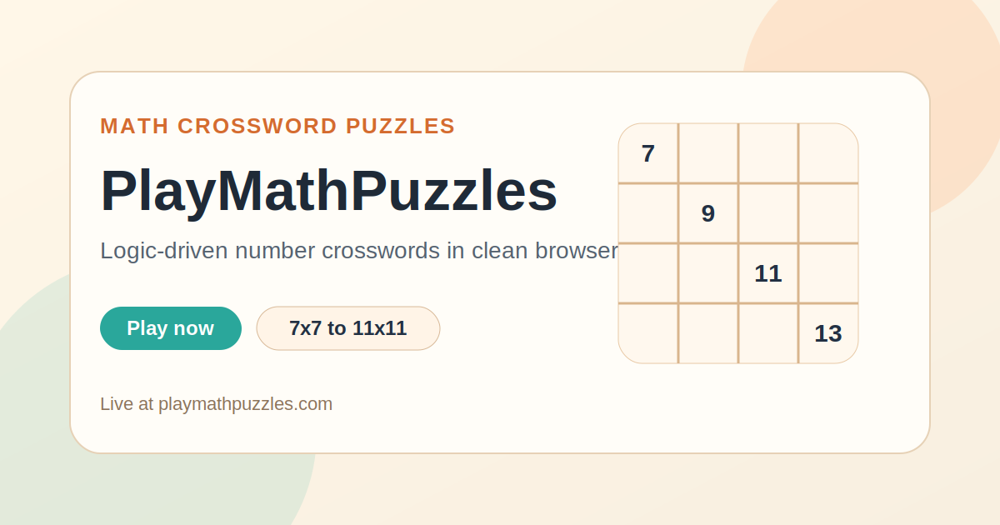

  

<h1 align="center">PlayMathPuzzles</h1>

  Browser-based math crossword puzzles with clean layouts, multiple grid sizes, and a product structure designed for both play and long-tail search growth.

  <a href="https://playmathpuzzles.com/"><strong>Play Now</strong></a>
  ·
  <a href="https://playmathpuzzles.com/7x7-math-crossword/"><strong>7x7</strong></a>
  ·
  <a href="https://playmathpuzzles.com/11x11-math-crossword/"><strong>11x11</strong></a>

  

## What It Is

PlayMathPuzzles is a math-puzzle project centered around crossword-style number grids. The experience is built for players who like logic, arithmetic, and structured problem solving without the weight of a heavy app shell.

This public repository is a simple GitHub showcase for the live site and its core puzzle modes.

## Live Sections

| Section | Link | Purpose |
| --- | --- | --- |
| Home | [playmathpuzzles.com](https://playmathpuzzles.com/) | Main product entry |
| 7x7 Math Crossword | [playmathpuzzles.com/7x7-math-crossword/](https://playmathpuzzles.com/7x7-math-crossword/) | Balanced grid size |
| 9x9 Math Crossword | [playmathpuzzles.com/9x9-math-crossword/](https://playmathpuzzles.com/9x9-math-crossword/) | Deeper puzzle chain |
| 11x11 Math Crossword | [playmathpuzzles.com/11x11-math-crossword/](https://playmathpuzzles.com/11x11-math-crossword/) | Largest, most demanding grid |
| Medium Math Crossword | [playmathpuzzles.com/math-crossword-medium/](https://playmathpuzzles.com/math-crossword-medium/) | Mid-difficulty landing page |

## Why It Feels Different

- The product focuses on one clear mechanic instead of mixing unrelated puzzle types.
- Grid-size pages create distinct experiences without changing the overall interface language.
- The site feels more like a clean puzzle library than a content farm.
- Math and logic framing makes it useful for both entertainment and learning-oriented search intent.

## Project Snapshot

- Topic: math crossword and number logic puzzles
- Stack: HTML, CSS, vanilla JavaScript
- Modes: multiple crossword sizes and landing pages
- UX goal: clean, readable grids and approachable puzzle flow
- SEO goal: intent-based puzzle pages with strong internal linking across formats

## More Projects

| Project | Live site | Public repo |
| --- | --- | --- |
| SkillSudoku | [skillsudoku.com](https://skillsudoku.com/) | [skillsudoku_public](https://github.com/ivanlukichev/skillsudoku_public) |
| CalcSprint | [calcsprint.com](https://calcsprint.com/) | [CalcSprint](https://github.com/ivanlukichev/CalcSprint) |
| Number Hunt | [numberhuntgame.com](https://numberhuntgame.com/) | [numberhuntgame](https://github.com/ivanlukichev/numberhuntgame) |
| Sudoku Play | [sudoku-play.org](https://sudoku-play.org/) | [Sudoku-Play](https://github.com/ivanlukichev/Sudoku-Play) |

## Visit

  <a href="https://playmathpuzzles.com/"><strong>Open PlayMathPuzzles</strong></a> 
  <a href="https://playmathpuzzles.com/7x7-math-crossword/">Play 7x7 Math Crossword</a> 
  <a href="https://playmathpuzzles.com/11x11-math-crossword/">Play 11x11 Math Crossword</a>

